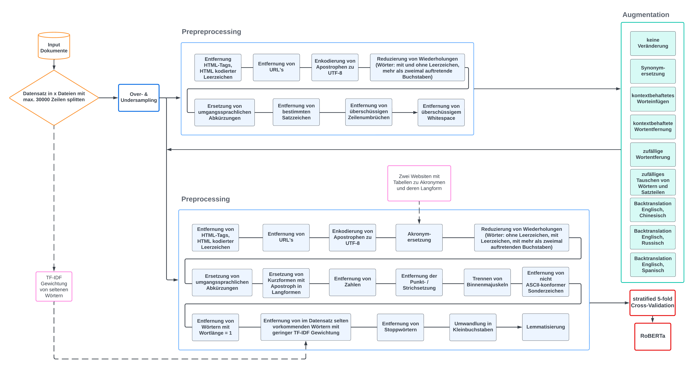

# Trigger-Detection
## System zur Trigger-Erkennung und Labeln von Texten

Im Zuge eines studentischen Softwareprojektes sollte ein System zur Erkennung von Triggern und Labeln von Fan-Fiction-Werken mit den Vorgaben des PAN 2023 entwickelt werden. Die Programmierung umfasst aktuell ein ausführliches Preprocessing, einen eigens entwickelten Sampling-Algorithmus mit verschiedenen Datensatzerweiterungen sowie das neuronale Netz RoBERTa-base. 
 Es gibt noch zahlreiche Optimierungsmöglichkeiten, wie beispielsweise Anpassungen im Programmablauf, das Einbinden des Abgleiches von Ober- und Unterkategorien oder die Übergabe von mehr als einer Sequenz pro Fan-Fiction-Werk an RoBERTa. 
 Nähere Informationen zur Programmierung sind in den einzelnen Python-Skripts zu finden.
 
## Systemskizze

